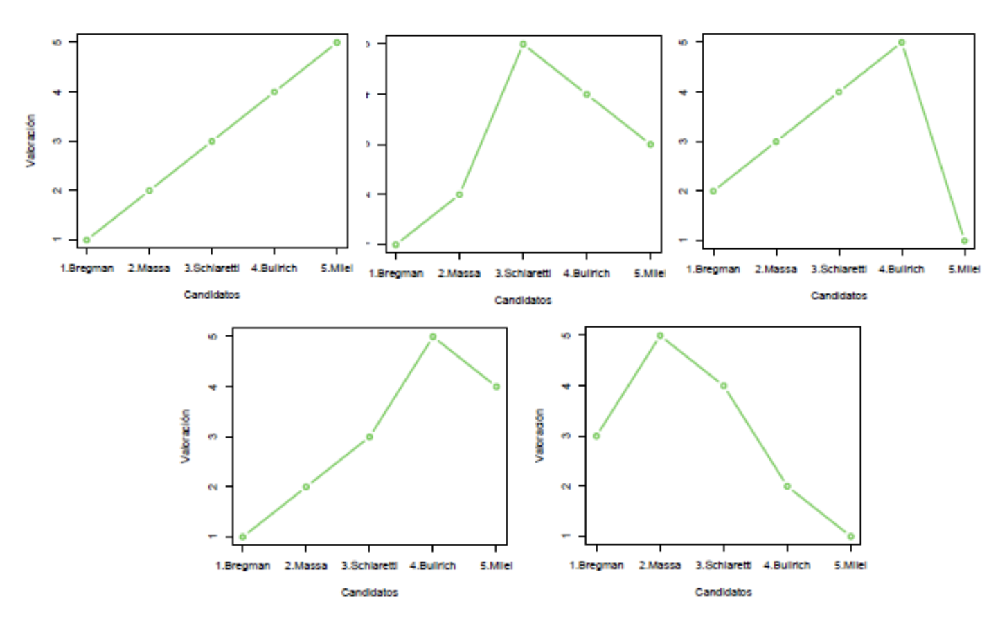

\newpage

## Presentacion

\newpage

# Indice

- [Unidad 1](#1)

- [Unidad 2](#2)

  - [Sistemas de Votación](#2_1)
  - [Modelo de Meltzer & Richard](#2_2)
  - [Pico Único y Cruce Único](#2_3)

- [Unidad 3](#3)

  - [Modelo simple de no democracia](#3_1)
  - [Modelo Democratización](#3_2)

- [Unidad 4](#4)

\newpage

# Unidad 1 {#1}

\newpage

# Unidad 2 {#2}

## Sistemas de Votación {#2_1}

1.1) Suponga que existen 5 grupos de individuos con los siguientes ordenamientos de preferencias sobre 5 alternativas

- Preferencias
  - (21 personas) $C>A>E>B>D$
  - (15 personas) $B>D>A>C>E$
  - (12 personas) $A>B>E>D>C$
  - (8 personas) $D>C>E>A>B$
  - (4 personas) $E>A>D>B>C$

Responda que alternativa resulta ganadora bajo los siguientes métodos de votación colectiva:

a)  Pluralidad
b)  Mayoría Absoluta
c)  Votación de Condorcet
d)  Método Borda (criterio de n-1)

Respuestas:

a)  C
b)  No hay ganador
c)  A
d)  A

1.2) Suponga que existen 3 grupos de individuos con los siguientes ordenamientos de preferencias sobre 5 alternativas

- Preferencias
  - (20 personas) $A>C>D>B>E$
  - (13 personas) $C>E>A>D>B$
  - (11 personas) $E>B>D>A>C$

Responda que alternativa resulta ganadora bajo los siguientes métodos de votación colectiva:

a)  Pluralidad
b)  Mayoría Absoluta
c)  Votación de Condorcet
d)  Método Borda (criterio de n)

Respuestas:

a)  A
b)  No hay ganador
c)  No hay ganador de Condorcet
d)  A

\

2)  Una elección acerca del siguiente ganador del Balón de Oro en octubre del 2024 debe ser decidida a través del método Borda. A la recta final llegaron 5 candidatos (A, B, C, D y E) y hay 45 votantes entre los cuales se encuentran grandes eminencias del deporte.

Si el jugador A obtiene 136 puntos, el jugador B obtiene 129 puntos, el C obtiene 148. el D obtiene 118 y E obtiene **?**.

¿Qué criterio se utiliza, "n" o "n-1"? ¿Qué candidato será el ganador del premio? ¿Cuántos votos obtuvo E?

\

3)  Condorcet: Se realizó una votación entre expertos del mundo del tenis para determinar quién fue el mejor tenista del "Big Four" al que componen Murray (M), Federer (F), Nadal (N) y Djokovic (D). Las preferencias de lo expertos son las siguientes:

- (23 personas) $F>D>N>M$
- (31 personas) $D>N>F>M$
- (27 personas) $N>F>D>M$

Se resuelve una votacion de a pares. ¿Existe el ganador de Condorcet?

Respuesta: Hay Ciclo de Condorcet ya que las preferencias no son de pico único.

\

4) Suponga que existen 5 grupos de individuos con los siguientes ordenamientos de preferencias sobre 5 alternativas (A, B, C, D, E):

- **Grupo 1** (20 personas): $B \succ D \succ C \succ A \succ E$
- **Grupo 2** (8 personas): $B \succ C \succ D \succ E \succ A$
- **Grupo 3** (10 personas): $C \succ A \succ D \succ B \succ E$
- **Grupo 4** (7 personas): $A \succ C \succ D \succ E \succ B$
- **Grupo 5** (5 personas): $D \succ C \succ A \succ B \succ E$

¿Qué alternativa resulta ganadora bajo los siguientes sistemas de votación: Pluralidad, Mayoría Absoluta, Condorcet y Método de Borda (criterio n-1)? ¿Qué conclusiones obtiene después de observar los distintos resultados?

**Respuesta:**

Teniendo en cuenta que hay 50 personas en total (20 + 8 + 10 + 7 + 5 = 50), la alternativa ganadora bajo cada uno de los criterios es:

1.  **Pluralidad:** Gana la alternativa **B** por tener la mayor cantidad de primeros lugares (28 votos en total: 20 del Grupo 1 + 8 del Grupo 2).

2.  **Mayoría Absoluta:** Para ganar, se requieren al menos 26 votos (la mitad más uno). Esta condición la cumple únicamente la alternativa **B** con sus 28 votos.

3.  **Condorcet:** Realizamos los enfrentamientos de a pares empezando por la A:

    - **A vs B:** 22 vs 28 $\rightarrow$ Gana **B** (A queda eliminada).
    - **B vs C:** 28 vs 22 $\rightarrow$ Gana **B**.
    - **B vs D:** 28 vs 22 $\rightarrow$ Gana **B**.
    - **B vs E:** 43 vs 7 $\rightarrow$ Gana **B**. La alternativa **B** gana todos sus enfrentamientos, por lo que es la ganadora de Condorcet.

4.  **Método de Borda (criterio n-1):** Asignamos puntajes del 4 al 0 (donde el primer lugar vale 4 puntos, el segundo 3, etc.) y multiplicamos por la cantidad de personas en cada grupo:

    - $A = (20 \cdot 1) + (8 \cdot 0) + (10 \cdot 3) + (7 \cdot 4) + (5 \cdot 2) = 88$
    - $B = (20 \cdot 4) + (8 \cdot 4) + (10 \cdot 1) + (7 \cdot 0) + (5 \cdot 1) = 127$
    - $C = (20 \cdot 2) + (8 \cdot 3) + (10 \cdot 4) + (7 \cdot 3) + (5 \cdot 3) = \textbf{140}$
    - $D = (20 \cdot 3) + (8 \cdot 2) + (10 \cdot 2) + (7 \cdot 2) + (5 \cdot 4) = 130$
    - $E = (20 \cdot 0) + (8 \cdot 1) + (10 \cdot 0) + (7 \cdot 1) + (5 \cdot 0) = 15$

    La alternativa **C** resulta ganadora con 140 puntos.

**Conclusión:** En este perfil, la alternativa B gana casi todo en votos directos (Pluralidad, Mayoría y Condorcet), pero C gana por el método de Borda. Esto demuestra cómo distintos métodos de votación pueden producir diferentes vencedores.

También evidencia que puede existir un ganador de Condorcet (B) que no coincida con el ganador del método de Borda (C). Además, dado que C gana por Borda siendo la favorita *únicamente* del Grupo 3, se muestra que puede resultar ganadora una alternativa que no sea la favorita general (o de varios grupos), pero que está consistentemente bien rankeada (segunda o tercera opción) entre todos los votantes.

\

5) Votación de The Beatles

Los miembros del comité editorial de la revista Rolling Stone se reunieron para votar cuál fue el mejor integrante de los Beatles con el fin de decidir a quién dedicar el próximo número de la revista. La comisión estaba formada por 60 expertos, quienes expresaron sus preferencias completas sobre los cuatro Beatles: Ringo (R), George (G), John (J) y Paul (P). El resultado de las votaciones fue el siguiente:

- **Grupo 1** (20 expertos): $R \succ P \succ G \succ J$
- **Grupo 2** (18 expertos): $P \succ G \succ J \succ R$
- **Grupo 3** (22 expertos): $G \succ J \succ R \succ P$

Determine quién resulta ganador bajo el sistema de votación de Condorcet. Grafique las preferencias de cada grupo, en donde el ordenamiento de las alternativas es el siguiente: Ringo (R), George (G), John (J) y Paul (P). ¿Por qué obtenemos este resultado? Justifique.

**Respuesta:**

Realizamos los enfrentamientos de a pares, empezando con "R":

- **R vs G:** 20 vs 40 $\rightarrow$ Gana **G** ("R" queda eliminado).
- Seguimos con "G": **G vs J:** 60 vs 0 $\rightarrow$ Gana **G** ("J" queda eliminado).
- Seguimos con "G": **G vs P:** 22 vs 38 $\rightarrow$ Gana **P** ("G" queda eliminado).
- Empezamos las comparaciones con "P": **P vs J:** 38 vs 22 $\rightarrow$ Gana **P** ("J" queda eliminado).
- Seguimos con "P": **P vs R:** 18 vs 42 $\rightarrow$ Gana **R**.

Pero sabemos que "R" no puede ser ganador del Condorcet, ya que pierde contra "G". Se produce un **Ciclo de Condorcet** (R le gana a P, P le gana a G, y G le gana a R). Vuelve a empezar toda la votación. **Ninguna alternativa resulta ganadora.**

Gráficamente observamos que esto se da porque ni el grupo 1 ni el 2 tienen preferencias de pico único.

## Modelo de Meltzer & Richard {#2_2}

6)  Suponga una sociedad conformada por $n_{p}=530$ individuos pobre y $n_{r}=123$ individuos ricos y que éstos tienen un ingreso de $y_{p}=112$ y de $y_{r}=150$, respectivamente. A partir de aquí suponga un impuesto a las ganancias del $9\%$. Con esta información, responda:
    i)  ¿Cuál es el ingreso directo de los pobres?
    ii) Si se somete a votación por mayoría absoluta una nueva alícuota del $12\%$ ¿Qué sucedería?
    iii) ¿Existe desigualdad? ¿Por qué?

## Pico Único y Cruce Único {#2_3}

7)  De acuerdo a los siguiente gráficos de preferencias politicas determine:

<!-- -->

a)  ¿Son preferencias de pico único?
b)  ¿Son preferencias de Cruce único?

\newpage

# Unidad 3 {#3}

## Modelo simple de no democracia {#3_1}

8)  En 1810, la élite española concentraba el 80% de la riqueza del Virreinato del Río de la Plata. Los criollos lograron organizarse, por lo que su poder para la revolución es alto (Estado de la Naturaleza H). La guerra revolucionaria y el costo en vidas asociado a ella destruiría el 30% de los recursos disponibles. Determine cual es la resolución de este juego.

## Modelo Democratización {#3_2}

9)  En 1992, la élite afrikaaner representaba el 21% de la población y concentraba el 90% de los recursos de Sudáfrica. El African National Congress (ANC) logró, luego de mucho tiempo, organizarse de la mano de Nelson Mandela y reunir el poder de facto necesario para la revolución (Estado de la Naturaleza H). La revolución sería catastrófica: destruiría el 50% de la riqueza. El umbral para la redistribución, de acuerdo con lo que está dispuesta a ceder la élite, es de 0.7, mientras que el umbral para la democratización es de 0.3. Determine cual es la resolución de este juego.

\newpage

# Unidad 4 {#4}
